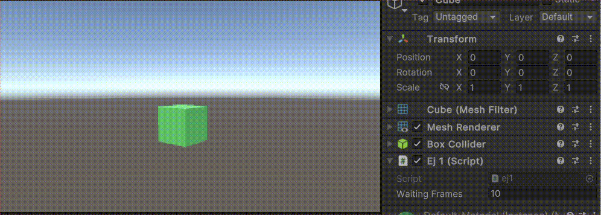

# Práctica 2 - Introducción a C# (scripts)
### Escena 1
*En la escena 1 se ha implementado el ejercicio 1*
- **Ejercicio 1**: En esta escena se ha creado un cubo al que se le ha asociado como componente el script *ej1*. El script inicializa el color del cubo utilizando un *Vector3* con valores aleatorios entre 0.0 y 1.0. Posteriormente, cada 120 frames (se puede modificar desde el inspector), se cambia aleatoriamente uno de los componentes del vector (x, y o z), actualizando el color del cubo.

    

    

### Escena 2
*En la escena 2 se han implementado los ejercicios del 2 al 7*
- **Ejercicio 2**:
- **Ejercicio 3**:
- **Ejercicio 4**:
- **Ejercicio 5**:
- **Ejercicio 6**:
- **Ejercicio 7**:
### Escenario 3
*En la escena 3 se ha implementado el ejercicio 8*
- **Ejercicio 8**:

