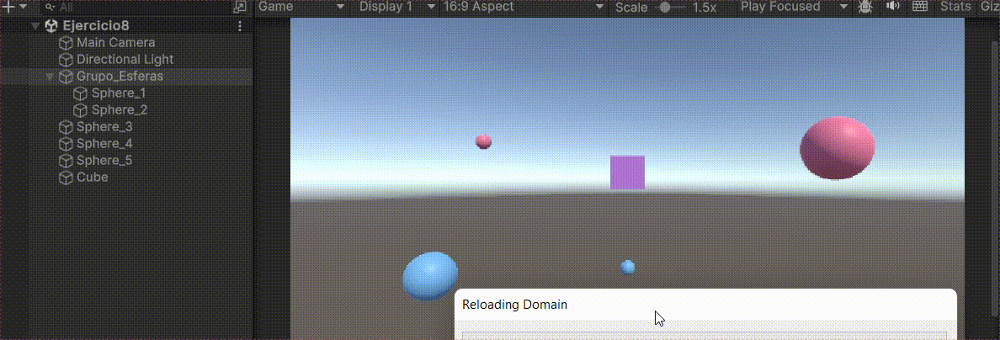

# Práctica 2 - Introducción a C# (scripts)
### Escena 1
*En la escena 1 se ha implementado el ejercicio 1*
- **Ejercicio 1**: En esta escena se ha creado un cubo al que se le ha asociado como componente el script *ej1*. El script inicializa el color del cubo utilizando un *Vector3* con valores aleatorios entre 0.0 y 1.0. Posteriormente, cada 120 frames (se puede modificar desde el inspector), se cambia aleatoriamente uno de los componentes del vector (x, y o z), actualizando el color del cubo.

| **Actualiza cada 120 frames** | **Actualiza cada 10 frames** |
|:-----------------------------:|:----------------------------:|
|| |

### Escena 2
*En la escena 2 se han implementado los ejercicios del 2 al 7*
- **Ejercicio 2**: En esta escena, se crean los cuatro elementos solicitados (plano, esfera, cubo y cilindro). A cada uno se le asigna un nombre, una etiqueta y un material para personalizarlos. Además, se les añade como componente el script *ej2*, el cual obtiene el nombre de cada objeto y lo muestra en la consola.

    
  
- **Ejercicio 3**: En este caso, se reutiliza la escena anterior con sus cuatro elementos. Se crea el script *ej3* y se añade como componente únicamente a la esfera. Este script define dos vectores, visibles en el inspector de la esfera, y realiza las cuatro operaciones solicitadas sobre ellos.

    
  
- **Ejercicio 4**: Al igual que en el ejercicio anterior, se reutiliza la misma escena con los cuatro elementos. Se añade un nuevo script, *ej4*, como componente de la esfera. Este script muestra por consola la posición actual de la esfera, la cual se puede verificar en el inspector para confirmar que es correcta.

    
  
- **Ejercicio 5**: Como en los ejercicios anteriores, se reutiliza la misma escena. Se crea el script *ej5*, que se añade como componente a la esfera. En este script, se definen dos *Transform* públicos (uno para el cubo y otro para el cilindro). En el inspector, se arrastran el cubo y el cilindro a sus respectivos *Transform* en el inspector de la esfera. El script se encarga de calcular la distancia entre la esfera y ambos objetos: la distancia de la esfera al cubo y la distancia de la esfera al cilindro.
  
    
  
- **Ejercicio 6**: En este caso, se reutiliza la escena y sus elementos. Se añade un objeto vacío a la escena, al que se le asocia el script *ej6*. En este script, se definen tres Vector3 públicos, uno para cada objeto (esfera, cubo y cilindro), que representan el desplazamiento de cada uno. A estos vectores se les asignan valores por defecto que pueden ser modificados desde el inspector. El script establece que, al presionar la barra espaciadora, a cada objeto se le sumará el desplazamiento correspondiente, actualizando así su posición en la escena.
  
    
  
- **Ejercicio 7**: En este ejercicio también se reutiliza la escena anterior. Se ha creado el script *ej7*, que se ha asociado tanto al cubo como al cilindro. El script contiene un componente *Renderer* que corresponde al objeto al que está asociado (cubo o cilindro) y se define una etiqueta que toma el valor de la etiqueta del objeto en cuestión. El comportamiento del script es el siguiente: si el objeto tiene la etiqueta "cilindro" y se pulsa la tecla "c", el cilindro cambiará de color a un color aleatorio utilizando la función *Random.ColorHSV()*. Si el objeto tiene la etiqueta "cubo" y se pulsa la tecla de la flecha hacia arriba, el cubo cambiará de color de manera similar.
  
    
  
### Escenario 3
*En la escena 3 se ha implementado el ejercicio 8*
- **Ejercicio 8**: Para evitar saturar la escena anterior, se crea una nueva escena en la que se añaden cinco esferas y un cubo. De las cinco esferas, dos tienen la etiqueta "tipo_1" y tres la etiqueta "tipo_2". El objetivo es cambiar el color de la esfera de "tipo_2" más lejana al cubo, y elevar la esfera de "tipo_2" más cercana al cubo (modificando su componente *y*). Para lograr esto, el script *ej8* se asocia al cubo. En el script, se obtienen todas las esferas con la etiqueta "tipo_2" y se almacenan en un vector. Luego, se recorre este vector en un bucle para encontrar las esferas más cercana y más lejana al cubo. Una vez identificadas, se aplican los cambios solicitados: la esfera más cercana se eleva y la más lejana cambia de color (*Este tarda un poco en verse en el gif el cambio*).
  
    

